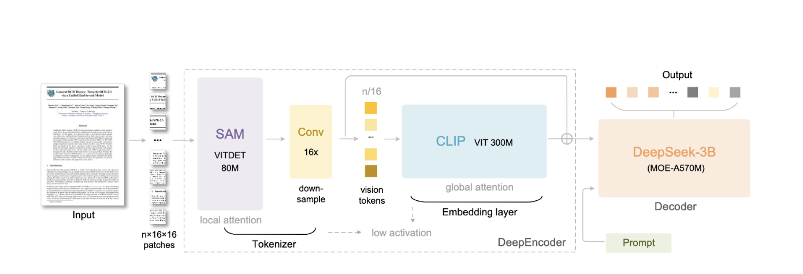

# VLM-OCR Recipes on GPU Infrastructure


Wondering how to exploit open-source models for large-scale inference tasks like optical character recognition (OCR) without necessarily relying on APIs?

Running OCR on thousands of documents quickly becomes an infrastructure problem: job orchestration, batching, cost control, and reproducibility matter just as much as model quality.

This article explores practical, cloud-agnostic OCR recipes built on open-source models, showing how to run batch OCR inference reliably across different GPU infrastructure providers.

**In this article, you will learn how to:**

- Set up DeepSeek-OCR with vLLM for high-throughput document processing
- Design a modular pipeline that extracts text, figures, and layout from documents
- Deploy batch inference jobs on Hugging Face Jobs, AWS SageMaker, or Google Cloud Run
- Optimize batch size and concurrency for efficient GPU utilization
- Estimate costs and scale processing to thousands of documents

To make this concrete, I provide the `batch-ocr-inference` module with ready-to-use building blocks and platform-specific notebooks.


### Performance Gains and Production Readiness of Open-Source OCR Models

Over the past few years, open-source OCR has undergone a major leap in performance, driven by advances in vision-language (VL) models and large-scale multimodal pretraining. While early neural OCR models already improved robustness over traditional rule-based engines, recent releases have significantly expanded what open OCR systems can handle in practice. Models such as DeepSeek-OCR, TrOCR, Qwen-VL, InternVL, Chandra, and OlmOCR-2 demonstrate strong improvements on complex layouts, multilingual documents, degraded scans, and structured content like tables or forms. The inclusion of standardized evaluations such as **OlmOCR scores** further helps quantify these gains, providing a clearer comparison of OCR quality across models on realistic document benchmarks. Unlike traditional OCR pipelines that output plain text, these newer models can directly generate structured representations such as Markdown or JSON, reducing the need for heavy post-processing.

Just as importantly, many of these OCR-focused VL models are designed with **production constraints in mind**. Operating typically in the 1B-7B parameter range, they strike a practical balance between accuracy, memory footprint, and throughput. This moderate size allows them to fit on a single GPU, enables efficient batching, limits cold-start and model-loading overhead, and keeps inference costs predictable. In large-scale batch settings, this translates directly into higher documents-per-second throughput and better hardware utilization, critical properties for cloud-native OCR pipelines. Rather than relying on extremely large general-purpose multimodal models, these OCR-specialized VL models focus on visual grounding and text generation efficiency, making open-source OCR not only competitive with proprietary APIs, but also genuinely viable for scalable, cost-controlled production deployments.

For a deeper dive into the evolving open-source OCR landscape, including Chandra, OlmOCR-2, and OlmOCR-based evaluations, see the Hugging Face overview:  
https://huggingface.co/blog/ocr-open-models


### OCR Use Cases Across Industries

OCR has become a critical building block across multiple industries where large volumes of unstructured documents must be processed reliably. In the **financial services** sector, OCR is widely used to extract structured data from invoices, bank statements, and compliance documents, enabling automated accounting workflows, faster audits, and improved regulatory reporting at scale. In **logistics and supply chain**, OCR pipelines power the digitization of delivery notes, bills of lading, and customs forms, allowing organizations to automate document reconciliation, track shipments more accurately, and reduce manual processing in high-throughput operational environments. In both cases, batch OCR inference is essential: documents arrive in large volumes, latency is secondary to throughput, and cost-efficient, scalable processing is a core requirement.


With open-source OCR models now reaching production-grade performance, the remaining challenge is operationalizing them efficiently at scale. To make this concrete, I introduce the **batch-ocr-inference** use case from the `llm-lab` repository, which demonstrates how to run high-throughput OCR batch jobs using modern vision-language models across different cloud platforms. This example focuses on practical concerns such as batching, job orchestration, and scalable deployment, turning strong OCR models into usable production pipelines.


## Use Case: Batch OCR Inference with DeepSeek-OCR and FineVision

To ground this discussion of scalable OCR pipelines, I focus on a concrete example built around **DeepSeek-OCR**, an open-source OCR model designed to process complex documents efficiently. DeepSeek-OCR was developed by DeepSeek, an AI research company based in Hangzhou, China, and released with open weights and code.

### DeepSeek-OCR Architecture

DeepSeek-OCR introduces a novel **Native Resolution visual encoding with Optical Compression** architecture that addresses key challenges in document OCR: handling high-resolution inputs efficiently while maintaining accuracy on dense text layouts. The architecture consists of three core components:

1. **Native Resolution ViT Encoder**: Unlike models that downsample images to fixed resolutions, DeepSeek-OCR processes document images at their native resolution using a Vision Transformer (ViT) encoder. This preserves fine-grained details crucial for recognizing small fonts, tables, and complex layouts.

2. **Optical Token Compressor**: The key innovation is the optical compression module, which compresses the high-dimensional visual features from the ViT encoder into a compact set of "vision tokens." Rather than treating every word or character as a separate token, this compressor learns to encode entire document regions into dense representations. The compression ratio can be tuned to balance between accuracy and inference efficiency.

3. **Mixture-of-Experts (MoE) Language Decoder**: The compressed vision tokens are then fed into a MoE-based language model that generates structured output (Markdown, text, or layout annotations). The MoE architecture allows the model to scale capacity efficiently by activating only a subset of expert networks per token, keeping inference costs manageable.


*Figure: DeepSeek-OCR architecture overview showing the Native Resolution ViT encoder, Optical Token Compressor, and MoE Language Decoder pipeline. Extracted from the [DeepSeek-OCR paper](https://github.com/deepseek-ai/DeepSeek-OCR/blob/main/DeepSeek_OCR_paper.pdf).*

This optical compression approach has been shown to maintain high OCR accuracy while significantly reducing the number of tokens required for inference, making it easier to handle long documents and dense layouts in high-volume settings. For example, a full document page that would typically require thousands of vision tokens can be compressed to a few hundred, enabling faster decoding without sacrificing recognition quality.

DeepSeek-OCR is publicly available on Hugging Face and GitHub:  
https://huggingface.co/deepseek-ai/DeepSeek-OCR and https://github.com/deepseek-ai/DeepSeek-OCR

A key contributor to the improvements seen in modern vision-language OCR models is the availability of large, curated multimodal datasets such as **FineVision**. FineVision is an open dataset of over **24 million samples** created by unifying and cleaning more than 200 public sources into a consistent corpus for training and evaluating vision-language models, including OCR and document understanding tasks. Because of its scale and rigorous curation process, models trained on FineVision tend to generalize better across layouts, languages, and document types than those trained on smaller, less diverse collections.

FineVision aggregates many public sub-datasets into one unified interface, allowing you to select specific *subset/configs* when loading. Of particular interest for OCR workloads is the **olmOCR-mix-0225** subset from Allen AI, which contains **260,000 crawled PDF pages** from over 100,000 diverse PDFs: academic papers, legal documents, public domain books, brochures, and more. This subset includes challenging content that mirrors real-world enterprise use cases: graphics, handwritten text, multi-column layouts, tables, equations, and poor-quality scans. Available configs include `olmOCR-mix-0225-documents` (general documents) and `olmOCR-mix-0225-books` (book pages).

> **Licensing note**: FineVision is a *collection* of many datasets, each with its own license and terms. Make sure the subset you use is compatible with your intended downstream use (see the dataset card for details).

You can explore FineVision and its documentation here:
- **Dataset**: https://huggingface.co/datasets/HuggingFaceM4/FineVision
- **Exploration Space**: https://huggingface.co/spaces/HuggingFaceM4/FineVision

<iframe
    src="https://huggingfacem4-finevision.hf.space"
    frameborder="0"
    width="100%"
    height="600"
></iframe> 

The **batch-ocr-inference** recipe leverages DeepSeek-OCR (or similar OCR models) in a workflow that processes large batches of documents as parallel jobs rather than one-by-one. This pattern is critical for production use cases where throughput, scalability, and cost control matter. For example, processing tens of thousands of financial reports, legal contracts, or historical archives in a cloud environment. The workflow demonstrates how to structure batched inference, orchestrate compute across platforms like Hugging Face Jobs, AWS SageMaker, or Google Cloud Run, and manage outputs reliably so that you can focus on downstream tasks rather than low-level endpoint loops or manual orchestration.

## Batch OCR Pipeline: Three Stages

DeepSeek-OCR is not a traditional OCR engine that only extracts plain text. It is a vision-language model trained to jointly reason over **document images, layout, and visual content**, which enables a much richer form of document understanding. As illustrated in the DeepSeek-OCR paper, the model can:
- convert full document pages into structured Markdown,
- preserve layout and section boundaries,
- detect and crop figures, tables, and diagrams,
- perform *deep parsing* of figures, including complex visual content such as chemical structures,
- generate textual descriptions of images and figures when prompted.

These capabilities make DeepSeek-OCR particularly well-suited for large-scale document processing, but they also introduce a practical challenge: **not all document understanding tasks have the same computational profile or batching strategy**. Text extraction, figure understanding, and document assembly benefit from being handled separately when running at scale.

For this reason, the `batch-ocr-inference` workflow is explicitly structured into **three stages: Extract, Describe, and Assemble**. This separation allows each capability of DeepSeek-OCR (and complementary vision-language models) to be used where it is most effective, while keeping the pipeline scalable, debuggable, and cloud-agnostic.

---

### Stage 1: Extract


The **Extract** stage focuses on document-level OCR and layout parsing. In this phase, DeepSeek-OCR is used to:

- Convert document pages into structured Markdown rather than raw text.
- Preserve layout elements such as headings, paragraphs, and tables.
- Detect and crop embedded figures (charts, diagrams, images) as separate visual assets.

This mirrors DeepSeek-OCR’s ability to perform layout-aware OCR and deep parsing, including complex documents such as multilingual PDFs or technical papers. The outputs of this stage are:
- extracted text as Markdown,
- cropped figure images,
- layout metadata stored in a shared dataset format.

By isolating extraction, the pipeline ensures that OCR and layout parsing can be batched efficiently and reused independently of downstream enrichment steps.

---

### Stage 2: Describe


DeepSeek-OCR is also capable of **general visual understanding** beyond text recognition, including interpreting diagrams and images. However, processing figures benefits from dedicated prompts and often different batching strategies than page-level OCR.

In the **Describe** stage:
- Each extracted figure is processed independently.
- A vision-language inference step generates natural-language descriptions of the figure content.
- Descriptions are stored alongside the corresponding figure images.

This stage is **reusable for different figure processing tasks**. By changing the prompt, you can adapt it to:
- **Describe**: Generate natural-language captions for accessibility or search indexing.
- **Parse**: Extract structured data from charts, tables, or diagrams (e.g., JSON output).
- **Classify**: Categorize figures by type (photo, chart, diagram, logo, etc.).

This design reflects how DeepSeek-OCR (and similar VL models) can switch from OCR-focused prompts to image-understanding prompts. Separating this stage makes it possible to scale figure processing independently from text extraction, which is critical for documents with many visual elements.

---

### Stage 3: Assemble


The final **Assemble** stage recombines all intermediate artifacts into a coherent document representation:

- Extracted Markdown text is enriched with figure captions.
- Figure references are re-inserted at the correct positions.
- The final output is a single, enriched Markdown document.

This step leverages the structured outputs produced earlier rather than re-running OCR or vision inference. By postponing assembly to the end, the pipeline avoids tight coupling between extraction, visual understanding, and formatting logic.

---

## Implementation

The three-stage pipeline is implemented in the `llm_ocr/` directory, a Python module that runs on different GPU platforms depending on your infrastructure and budget.

### Project Structure

```
batch-ocr-inference/
├── llm_ocr/                 # Core pipeline module
│   ├── stages.py            # Extract, Describe, Assemble logic
│   ├── server.py            # vLLM client and server management
│   ├── storage.py           # Unified storage abstraction
│   ├── sm_io.py             # S3 dataset I/O (SageMaker)
│   ├── cloudrun_io.py       # GCS dataset I/O (Cloud Run)
│   └── config.py            # Environment-based configuration
├── hf-jobs/                 # Hugging Face Jobs deployment
├── google-cloud-run/        # Google Cloud Run deployment
└── sagemaker/               # AWS SageMaker deployment
```

### vLLM as Inference Backend

The pipeline uses [vLLM](https://docs.vllm.ai/) to serve DeepSeek-OCR. vLLM provides high-throughput inference through continuous batching and PagedAttention, making it ideal for batch processing. The pipeline launches vLLM as a subprocess and communicates via its OpenAI-compatible API, allowing the same code to run locally or in cloud containers.

### Platform Deep Dives

| Platform | GPU | Notebook |
|----------|-----|----------|
| **Hugging Face Jobs** | A100 (80GB) | [hf-jobs-pipeline.ipynb](hf-jobs/hf-jobs-pipeline.ipynb) |
| **AWS SageMaker** | L40S (48GB) | [sm-jobs-pipeline.ipynb](sagemaker/sm-jobs-pipeline.ipynb) |
| **Google Cloud Run** | L4 (24GB) | [cloudrun-jobs-pipeline.ipynb](google-cloud-run/cloudrun-jobs-pipeline.ipynb) |

Each notebook covers:
- **Platform setup** - Authentication, credentials, and prerequisites
- **Launching jobs** - Submitting pipeline stages to the platform
- **Displaying results** - Rendering extracted documents with figures
- **Cost analysis** - Real throughput benchmarks and pricing breakdown

The `llm_ocr/` module is copied into each platform's container at build time. Only the storage backend (HF Hub, S3, or GCS) and job orchestration differ, configured via environment variables.

For detailed configuration options and local development setup, see the [README](README.md).

## Scale and Cost

The Extract stage processes up to **100 document pages per minute** on a single GPU. At typical cloud GPU rates ($1-4/hour), processing 10,000 pages costs roughly **$5-15** depending on the platform.

The Describe stage adds time proportional to the number of figures in your documents. For higher throughput, the pipeline can scale horizontally by running multiple jobs in parallel, each processing a different shard of the dataset.

---

## Conclusion

DeepSeek-OCR brings state-of-the-art document understanding to a single open-weights model. By combining it with vLLM's efficient serving and a modular three-stage pipeline, you can process large document collections at scale without relying on expensive proprietary APIs.

The implementation provided here is a starting point. You can adapt the prompts for your domain, swap storage backends, or extend the pipeline with additional processing stages. The notebooks offer ready-to-run examples on Hugging Face Jobs, AWS SageMaker, and Google Cloud Run - pick the platform that fits your infrastructure and get started.

